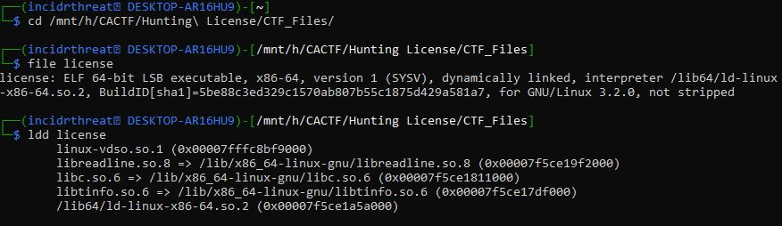
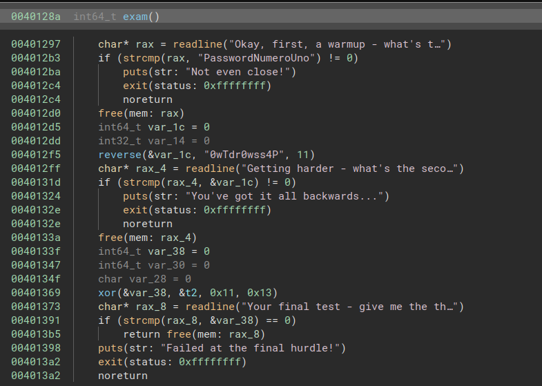
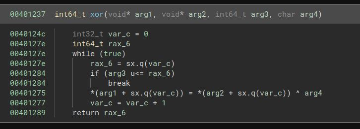
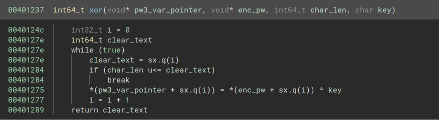
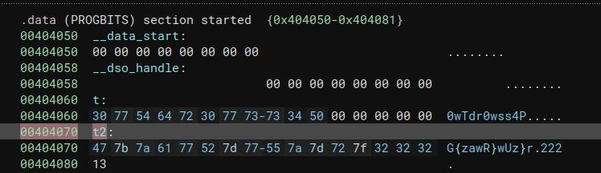
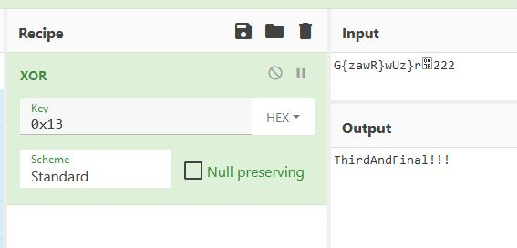
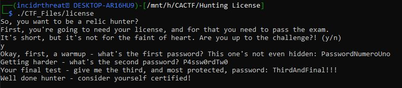
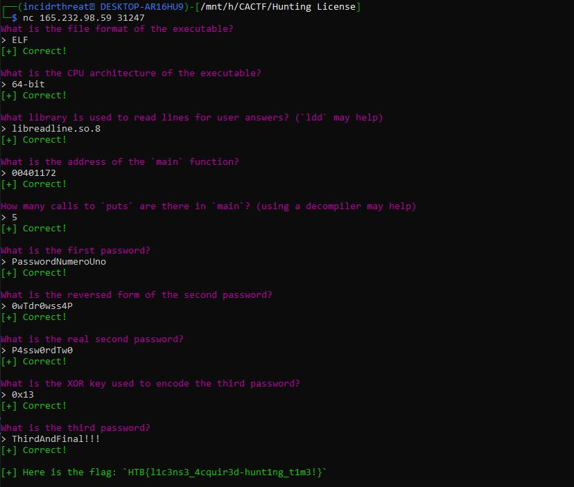

# Hunting License

A quick look at the file provides some good info we might need later.

Opening BinaryNinja we see the `exam()` and `xor()` functions.  Upon analyzing the `exam()` function we can see some clear-text information.

We can see the first password is `PasswordNumeroUno`, the second password is runs through a `reverse()` function which presumably reverses the clear-text of `0wTdr0wss4P` to be `P4ssw0rdTw0`. I didn't dig too much into it, but I noted that it was a separate function just in case.

Moving on we come to the third password which stores the output from `xor()` as `&var_38`.  It then compares it with `rax_8` which is user input.  More digging is required.

As we examine the XOR function below we can see that it takes in 4 args.  Those 4 args are presumably (based off the code) are a pointer to an empty `pw3` variable, the encoded third password, the length of the encoded password, and the xor key necessary to decode the password. The `xor()` then returns the clear-text password to be stored as `var_38` for later use.

Renaming the variables it should start to make sense what this xor function is doing.

XORing `t2` with the key `0x13` we found should provide the clear-text 3rd password.

After completing static analysis on the file we can run it to make sure our answers line up.

Nice!  Now to connect to the server and attempt to get the flag.

___________________

# Flag
`HTB{l1c3ns3_4cquir3d-hunt1ng_t1m3!}`