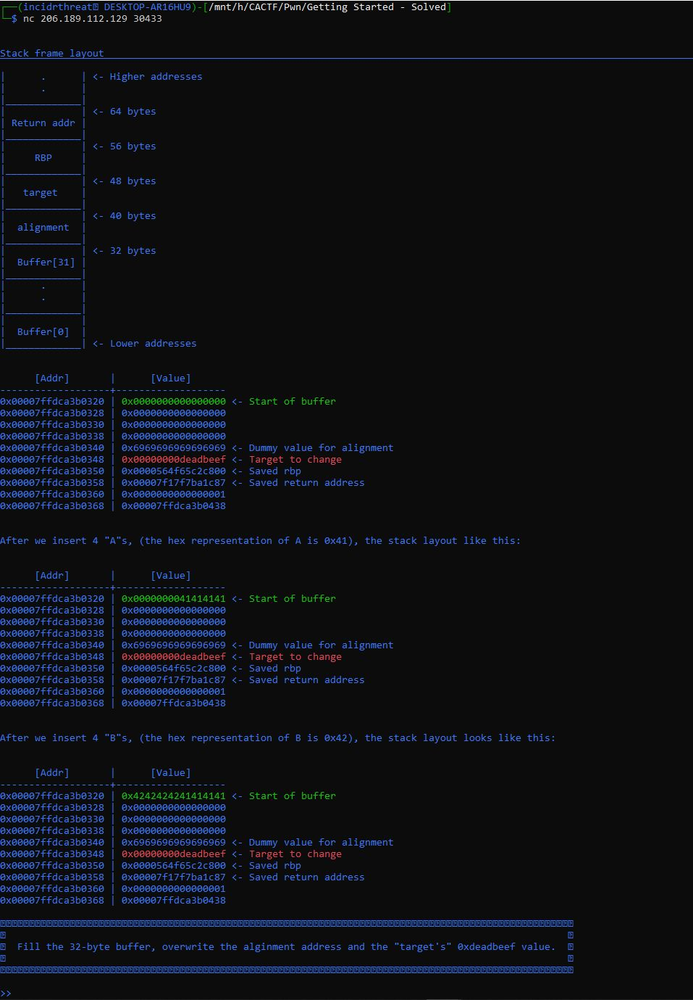
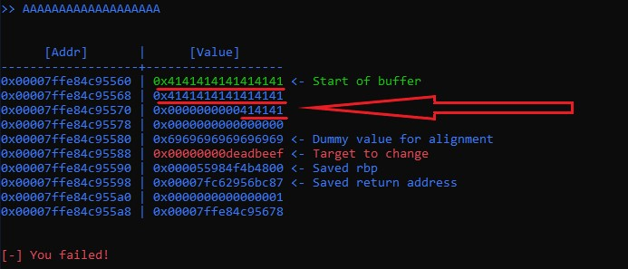
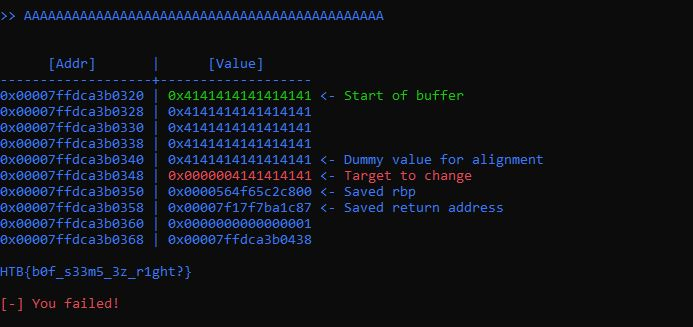

# Pwn - Getting Started
#### Get ready for the last guided challenge and your first real exploit. It's time to show your hacking skills.
_______________________

Connecting to the service using netcat we see some guided information: `Fill the 32-byte buffer, overwrite the alginment address and the "target's" 0xdeadbeef value.`

Populating some A's, we can see it filling up the buffer on the stack. This is represented as hex 41 (ascii A).

As we continue to add more A's onto the stack we overwrite data.  Pushing enough A's will over write the necessary memory address `0x00007ffe84c95588` where `0x00000000deadbeef` is located.  Once we do that we are provided the flag.

___________________

# Flag
`HTB{b0f_s33m5_3z_r1ght?}`