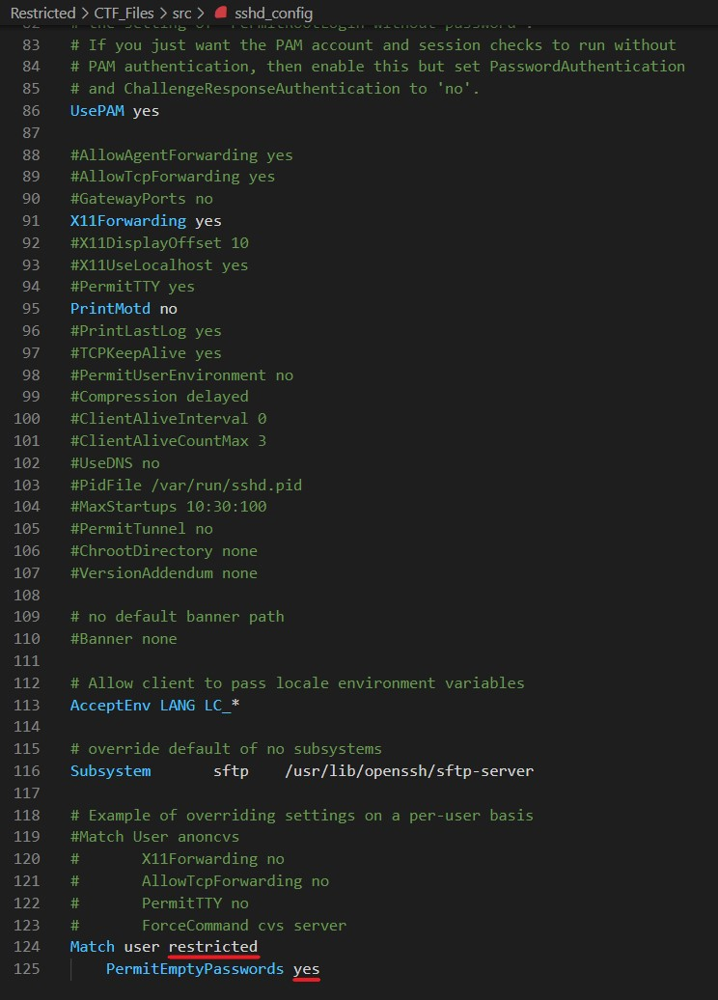
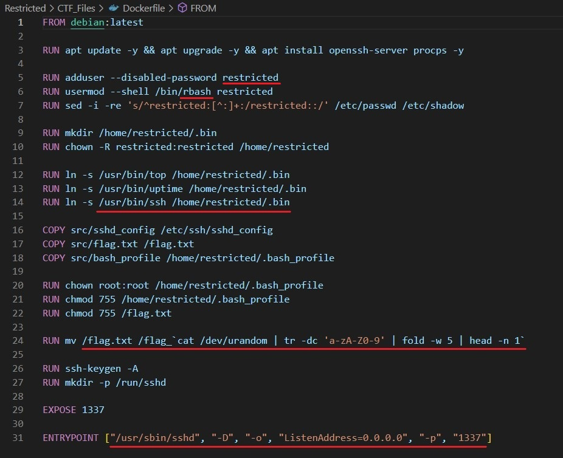
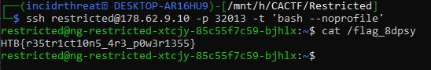

# Restricted
_______________________

After downloading and analyzing the files associated with Restricted, there are many things that stick out.

First thing to look at is `src/sshd_config` and it has 2 things that stand out, the user `restricted` and a `PermitEmptyPasswords` options--allow the user `restricted` to ssh into the machine without a password.  

The next we look at `Dockerfile`.  This tells us the configuration in which a docker container is setup to run.  Reading through the setup/config, we again see user `restricted` being added on line 5 and being assigned a `rbash` shell on line 6 which tells us it'll be a restricted env, there is a symbolic link setup for `top`, `uptime`, and `ssh` on lines 12-14, `flag.txt` is renamed to `flag_` + 5 random characters, and lastly we see the entrypoint setting up the ssd daemon listening on port 1337 on all interfaces.

After we do a quick google search there are plenty of ways to exit an rbash prompt.  The one that mostly likely fits our specific env is one where you ssh to the client using the `-t 'bash --noprofile'` option so that any `bash_profile` is ignored.

Source: https://www.hacknos.com/rbash-escape-rbash-restricted-shell-escape/

# Flag

`HTB{r35tr1ct10n5_4r3_p0w3r1355}`