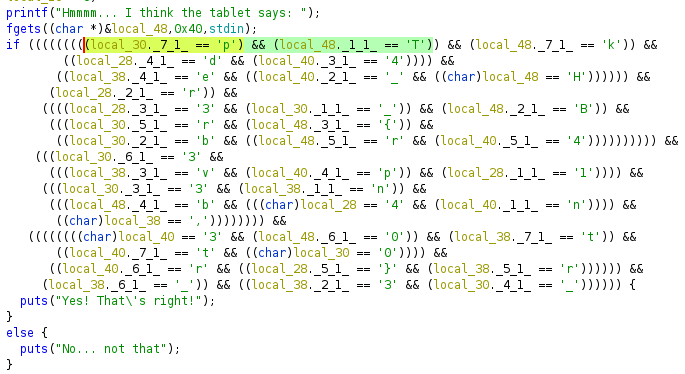

# Shattered Tablet

Initially looking at the binary in Ghidra you can see the data that resembles a large scrambled amount of ascii characters.



When we import the binary into BinaryNinja we see similar data.  If we convert the data to from hex to ascii as indicated from the first line showing the `p` we start seeing the same ascii data from Ghidra.  Knowing that our flag should start with `HTB{` we can reorder the lines containing `(arg1 - 0x**)` from hex 0x40 to 0x1b in decending order we see start to see the flag.

Orginal data from Binary Ninja and ghidra:
```
000011cc          if (*(arg1 - 0x21) != 'p')
000011d8          if (*(arg1 - 0x3f) != 0x54)
000011e4          if (*(arg1 - 0x39) != 0x6b)
000011f0          if (*(arg1 - 0x1c) != 0x64)
000011fc          if (*(arg1 - 0x35) != 0x34)
00001208          if (*(arg1 - 0x2c) != 0x65)
00001214          if (*(arg1 - 0x36) != 0x5f)
00001220          if (*(arg1 - 0x40) != 0x48)
0000122c          if (*(arg1 - 0x1e) != 0x72)
00001238          if (*(arg1 - 0x1d) != 0x33)
00001244          if (*(arg1 - 0x27) != 0x5f)
00001250          if (*(arg1 - 0x3e) != 0x42)
0000125c          if (*(arg1 - 0x23) != 0x72)
00001268          if (*(arg1 - 0x3d) != 0x7b)
00001274          if (*(arg1 - 0x26) != 0x62)
00001280          if (*(arg1 - 0x3b) != 0x72)
0000128c          if (*(arg1 - 0x33) != 0x34)
00001298          if (*(arg1 - 0x22) != 0x33)
000012a4          if (*(arg1 - 0x2d) != 0x76)
000012b0          if (*(arg1 - 0x34) != 0x70)
000012bc          if (*(arg1 - 0x1f) != 0x31)
000012c8          if (*(arg1 - 0x25) != 0x33)
000012d4          if (*(arg1 - 0x2f) != 0x6e)
000012e0          if (*(arg1 - 0x3c) != 0x62)
000012e8          if (*(arg1 - 0x20) != 0x34)
000012f0          if (*(arg1 - 0x37) != 0x6e)
000012f8          if (*(arg1 - 0x30) != 0x2c)
00001300          if (*(arg1 - 0x38) != 0x33)
00001308          if (*(arg1 - 0x3a) != 0x30)
00001310          if (*(arg1 - 0x29) != 0x74)
00001318          if (*(arg1 - 0x31) != 0x74)
00001320          if (*(arg1 - 0x28) != 0x30)
00001328          if (*(arg1 - 0x32) != 0x72)
00001330          if (*(arg1 - 0x1b) != 0x7d)
00001338          if (*(arg1 - 0x2b) != 0x72)
00001340          if (*(arg1 - 0x2a) != 0x5f)
00001348          if (*(arg1 - 0x2e) != 0x33)
00001350          if (*(arg1 - 0x24) != 0x5f)

```

Data converted and reordered:
```
00001220          if (*(arg1 - 0x40) != 'H')
000011d8          if (*(arg1 - 0x3f) != 'T')
00001250          if (*(arg1 - 0x3e) != 'B')
00001268          if (*(arg1 - 0x3d) != '{')
000012e0          if (*(arg1 - 0x3c) != 'b')
00001280          if (*(arg1 - 0x3b) != 'r')
00001308          if (*(arg1 - 0x3a) != '0')
000011e4          if (*(arg1 - 0x39) != 'k')
00001300          if (*(arg1 - 0x38) != '3')
000012f0          if (*(arg1 - 0x37) != 'n')
00001214          if (*(arg1 - 0x36) != '_')
000011fc          if (*(arg1 - 0x35) != '4')
000012b0          if (*(arg1 - 0x34) != 'p')
0000128c          if (*(arg1 - 0x33) != '4')
00001328          if (*(arg1 - 0x32) != 'r')
00001318          if (*(arg1 - 0x31) != 't')
000012f8          if (*(arg1 - 0x30) != ',')
000012d4          if (*(arg1 - 0x2f) != 'n')
00001348          if (*(arg1 - 0x2e) != '3')
000012a4          if (*(arg1 - 0x2d) != 'v')
00001208          if (*(arg1 - 0x2c) != 'e')
00001338          if (*(arg1 - 0x2b) != 'r')
00001340          if (*(arg1 - 0x2a) != '_')
00001310          if (*(arg1 - 0x29) != 't')
00001320          if (*(arg1 - 0x28) != '0')
00001244          if (*(arg1 - 0x27) != '_')
00001274          if (*(arg1 - 0x26) != 'b')
000012c8          if (*(arg1 - 0x25) != '3')
00001350          if (*(arg1 - 0x24) != '_')
0000125c          if (*(arg1 - 0x23) != 'r')
00001298          if (*(arg1 - 0x22) != '3')
00001298          if (*(arg1 - 0x21) != 'p')            # This was the first line in the code
000012e8          if (*(arg1 - 0x20) != '4')
000012bc          if (*(arg1 - 0x1f) != '1')
0000122c          if (*(arg1 - 0x1e) != 'r')
00001238          if (*(arg1 - 0x1d) != '3')
000011f0          if (*(arg1 - 0x1c) != 'd')
00001330          if (*(arg1 - 0x1b) != '}')
```
___________________

# Flag
`HTB{br0k3n_4p4rt,n3ver_t0_b3_r3p41r3d}`