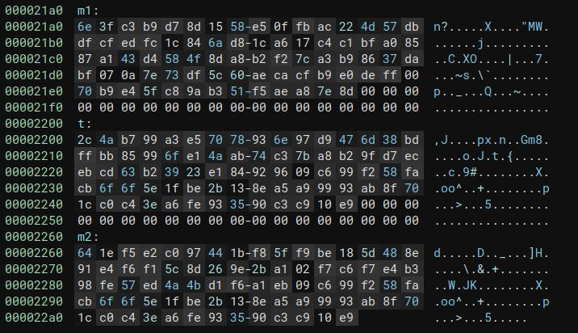

# She Shells C Shells
_______________________

Upon running the `shell` binary provided we can see that it has a few options.

Running the option `getflag` we can see that it requires a password to retreive the flag.

Opening the binary in BinaryNinja there are a few custom functions defined and one that makes sense to analyze.

Digging into `func_flag` we can see 2 `for` loops.  The first one takes in user input and compares it to `flag` and the length of 77 characters.  If they do not match, it does not proceed with the second loop and exits `func_flag`.  3 variables stick out as potential data to look at.  Within each for loop we see that data is being xor'd with the stored data.

Finding the `t`, `m1`, and `m2` variables in the .rodata of the binary allows us to extract it.

Using the python script `solve.py` to handle the Xor-ing we can see everything in clear-text.  We can then verify that the output of the xor'd password is the right password and it outputs the flag.

`HTB{cr4ck1ng_0p3n_sh3ll5_by_th3_s34_sh0r3}`