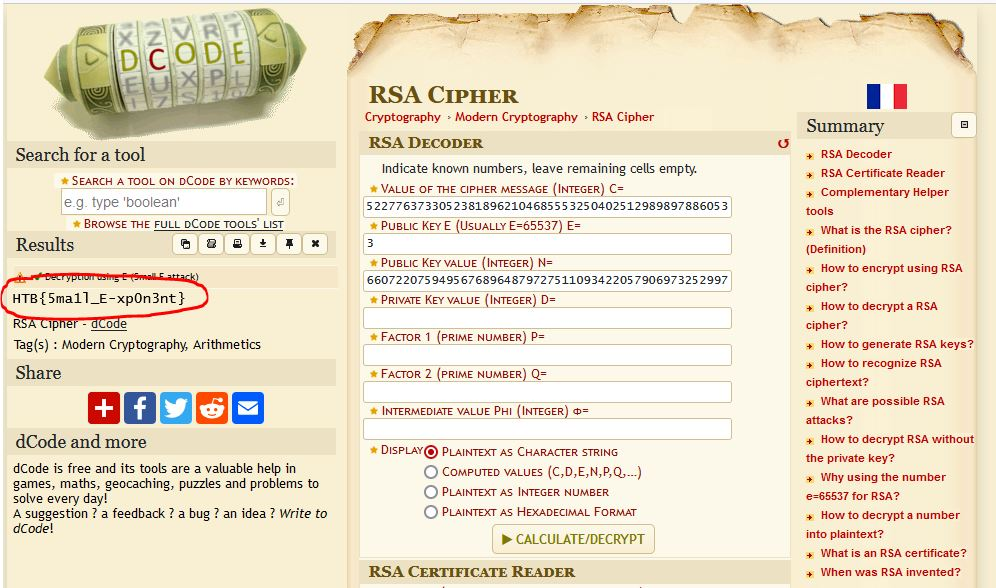

# Small StEps

Connecting to the provided server using netcat allows us to get the encrypted flag and provides us with additional RSA data.

`N: 5897987459716233367458410956263125118177610885881287513827357750991969732358116561716906894169177634434566072207594956768964879727511093422057906973252997`

`e: 3`

`The encrypted flag is: 70407336670535933819674104208890254240063781538460394662998902860952366439176467447947737680952277637330523818962104685553250402512989897886053`

Plugging the RSA data into https://www.dcode.fr/rsa-cipher, we get the decoded flag.

___________________

# Flag
`HTB{5ma1l_E-xp0n3nt}`
