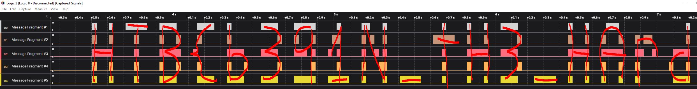
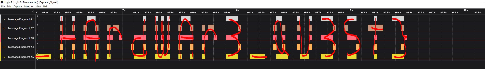

# Timed Transmission

After some analysis I determined I needed the application SAleae Logic 2.

Upon opening, it was obvious where the flag was going to be.  Visually if zoomed out the message framents appeared to look like `HTB{` if I squinted slightly.

___________________

# Flag
`HTB{b391N_tH3_HArdWAr3_QU3St}`